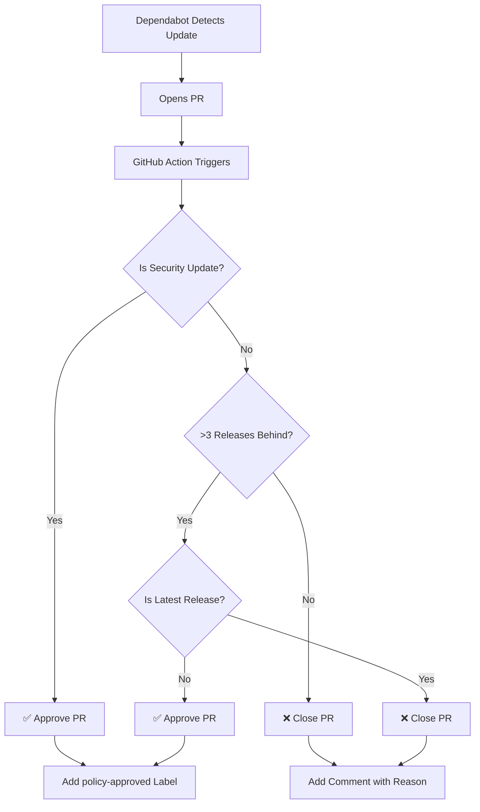

# Dependabot Version Policy Setup

This repository uses **Dependabot** with a custom **GitHub Action** to enforce smart version update policies.

---

## 📋 Version Policy Rules

Your Dependabot is configured with the following policies:

### ✅ Rule 1: Only Update if >3 Releases Behind
- PRs are **only created** if the current version is **more than 3 releases behind** the stable version
- Example: If you're on v1.0.0 and stable is at v1.5.0 (5 releases behind) → ✅ **PR created**
- Example: If you're on v1.3.0 and stable is at v1.5.0 (2 releases behind) → ❌ **PR rejected**

### ✅ Rule 2: Skip Most Recent Production Release
- Updates to the **latest/most recent** production release are **skipped**
- This provides stability by avoiding brand-new releases
- You'll be updated to the second-most-recent stable version instead

### ✅ Rule 3: Security Updates Override All Rules
- **Security-critical updates** bypass both rules above
- Any update containing CVE references or marked as security will be **immediately approved**
- PRs are labeled with `security-critical` for easy identification

---

## 📁 Files Created

### 1. `.github/dependabot.yml`
- Configures Dependabot to scan:
  - **Python** dependencies in `/todo-application/backend`
  - **npm** dependencies in `/todo-application/frontend`
- Runs **weekly on Mondays at 9:00 AM**
- Opens max **5 PRs per ecosystem** at a time

### 2. `.github/workflows/dependabot-filter.yml`
- **Automatically runs** when Dependabot opens a PR
- **Analyzes** the version difference using PyPI/npm registries
- **Applies policy rules** and either:
  - ✅ **Approves** the PR (adds `policy-approved` label)
  - ❌ **Closes** the PR with explanation (adds `policy-rejected` label)

---

## 🚀 How to Enable

### Step 1: Push to GitHub
```bash
git add .github/
git commit -m "feat: Add Dependabot with version policy enforcement"
git push origin main
```

### Step 2: Enable Dependabot (if not already enabled)
1. Go to your repository on GitHub
2. Navigate to **Settings** → **Security** → **Code security and analysis**
3. Enable **Dependabot alerts** and **Dependabot security updates**

### Step 3: Wait for First Scan
- Dependabot will run on the next **Monday at 9:00 AM**
- Or manually trigger: Go to **Insights** → **Dependency graph** → **Dependabot** → Click "Check for updates"

---

## 🔍 How It Works



---

## 🏷️ Labels Used

| Label | Meaning |
|-------|---------|
| `policy-approved` | PR meets version policy requirements |
| `policy-rejected` | PR does not meet version policy |
| `security-critical` | Security update (bypasses normal rules) |
| `ready-for-review` | Approved and ready for human review |
| `dependencies` | Auto-added by Dependabot |

---

## 🛠️ Testing the Setup

### Test 1: Check Dependabot Config
```bash
# GitHub provides a validation endpoint
curl -H "Authorization: token YOUR_GITHUB_TOKEN" \
  https://api.github.com/repos/YOUR_ORG/YOUR_REPO/contents/.github/dependabot.yml
```

### Test 2: Manually Trigger Dependabot
1. Go to **Insights** → **Dependency graph** → **Dependabot**
2. Click **"Check for updates"** button
3. Wait for PRs to be created

### Test 3: Verify Workflow Runs
1. Go to **Actions** tab in your repository
2. Look for **"Dependabot PR Filter"** workflow
3. Check the logs to see policy enforcement in action

---

## 🔧 Customization

### Change Minimum Releases Behind
Edit `.github/workflows/dependabot-filter.yml`, line ~142:
```javascript
// Change from 3 to your desired number
if (releasesBehind <= 3) {
  shouldClose = true;
  reason = `Only ${releasesBehind} releases behind (policy requires >3 releases behind)`;
}
```

### Change Schedule
Edit `.github/dependabot.yml`:
```yaml
schedule:
  interval: "daily"  # Options: daily, weekly, monthly
  day: "monday"      # For weekly: monday-sunday
  time: "09:00"      # Time in UTC
```

### Add More Ecosystems
Add to `.github/dependabot.yml`:
```yaml
- package-ecosystem: "docker"
  directory: "/"
  schedule:
    interval: "weekly"
```

Supported ecosystems: `bundler`, `cargo`, `composer`, `docker`, `elm`, `git-submodule`, `github-actions`, `gomod`, `gradle`, `maven`, `mix`, `npm`, `nuget`, `pip`, `terraform`

---

## 📊 Monitoring

### View Dependabot Status
- **Insights** → **Dependency graph** → **Dependabot** tab
- Shows all open PRs and update history

### Check Workflow Logs
- **Actions** tab → **Dependabot PR Filter** workflows
- Shows detailed logs of policy decisions

### Slack/Email Notifications (Optional)
Add to `.github/workflows/dependabot-filter.yml`:
```yaml
- name: Notify Slack
  if: steps.analyze.outputs.shouldClose == 'false'
  run: |
    curl -X POST ${{ secrets.SLACK_WEBHOOK_URL }} \
      -H 'Content-Type: application/json' \
      -d '{"text": "✅ Dependabot PR approved: ${{ github.event.pull_request.title }}"}'
```

---

## 🐛 Troubleshooting

### PR Not Being Filtered
- Check if workflow has **required permissions** (pull-requests: write)
- Verify GitHub Actions are **enabled** in repository settings
- Check **Actions** tab for error logs

### Workflow Not Triggering
- Ensure workflow file is on the **default branch** (usually `main`)
- Check if `pull_request` events are enabled
- Verify Dependabot is actually opening PRs

### Wrong Policy Decisions
- Check workflow logs in **Actions** tab
- Verify package name parsing is correct
- Test API endpoints manually (PyPI/npm registry)

---

## 📚 Additional Resources

- [Dependabot Documentation](https://docs.github.com/en/code-security/dependabot)
- [GitHub Actions Documentation](https://docs.github.com/en/actions)
- [Dependabot Configuration Options](https://docs.github.com/en/code-security/dependabot/dependabot-version-updates/configuration-options-for-the-dependabot.yml-file)

---

## 🤝 Support

If you encounter issues:
1. Check the **Actions** tab for workflow errors
2. Review Dependabot logs in **Insights** → **Dependency graph**
3. Verify GitHub permissions are correctly set
4. Test the API endpoints for your packages manually

---

**Created**: December 19, 2025  
**Last Updated**: December 19, 2025

